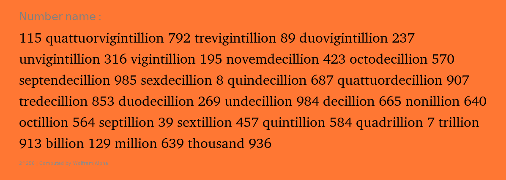
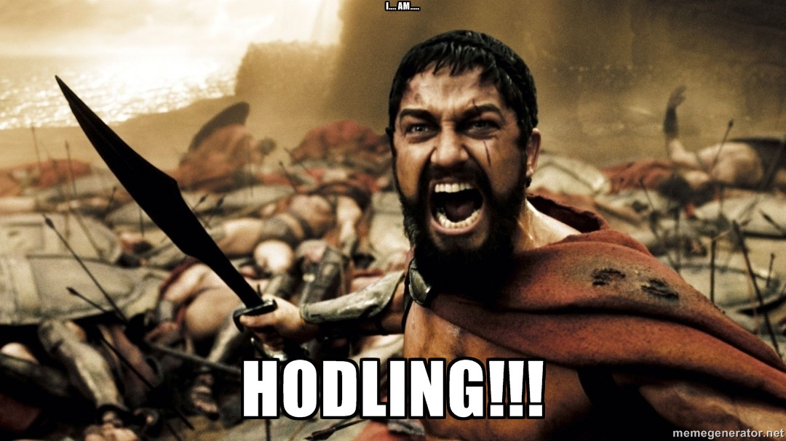
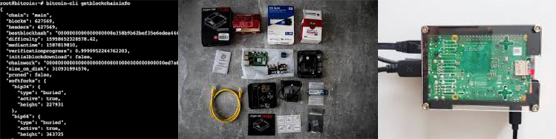
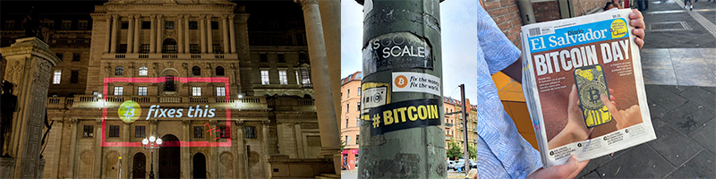

Learning about bitcoin is frequently illustrated as a journey into a rabbit hole. A typical thing about rabbit holes is that the bigger a rabbit family is the more complex are their connecting paths. Obviously, the bitcoin family is huge, hence there is a high chance to get lost in your early days.

Fortunately, there exist a lot of markers throughthought the (yet young) history of Bitcoin that enlighten our collective journey. Some of these orientation points are known all over and keep the community moving in the same direction. In case you are new to Bitcoin, it is likely that you have heard of these ubiquitios words and sentences, but probably do not know what they mean or where they come from. 

This guide aims to provide an introduction to Bitcoin considering these common proverbs that I like to call **Bitmantras**:

> A bitmantra is a sacred utterance or a memeic sound believed by Bitcoiners to have counterinflationary, decentralising and liberating power.

## Fix the money, Fix the world.

A careful obeservation of history and the current state of the art suggests that our *money is broken*. This brokeness reflects on our daily reality, be it the financial crisis or the upcoming inflation whereby misery and suffering are a consequence for the majority. History has shown that this is nothing new and is deeply related to the technology of money in use. The effect of this brokenness goes beyond our daily reality and has the capability to destroy not only our comfortable wealthy lives but also the world by misusing nature in an extremely inefficient way.

To see how broken the current technology of money is, [watch this video of Chief Economist at the ECB](https://www.youtube.com/watch?v=tY8rsXD6L_8), trying to explain how money is made. As a good starting point to dive deeper I can recommend [21 Lessons](https://21lessons.com/) by Gigi and  [The Bitcoin Standard](www.amazon.com%2FBitcoin-Standard-Decentralized-Alternative-Central%2Fdp%2F1119473861&usg=AOvVaw2yMY4ZFsrMpj5UckmvL05d) by Ammous Saifedean. 

## Don't trust. Verify.

Satoshi Nakamoto has realized this money-world-problem and proposed a solution on 9 pages: [Bitcoin: A Peer-to-Peer Electronic Cash System](https://bitcoin.org/bitcoin.pdf). The revolutionary innovation of bitcoin is that it does not rely on trust. This means that there is no need for a government, bank or any third party to make a transaction between two parties. This is made possible through intelligent use of *magic math* and a technology called *distributed ledger*. With this powerful combination it is possible to verify any transaction ever made and therefore eliminate the chances of misuse and the need for trust.

In practise this means, that any Bitcoiner has a pair ofkeys which are necessary to sign and verify transactions. These keys are the core of the magic math and enable a bulletproof security. The strength of this security is symbolized by the lathin phrase *Vires in Numeris* which means "Strength in Numbers". For an insightful demonstration of this strength and an explanation of the number below, I would recommend to read [Lesson 15 by Gigi](https://21lessons.com/15/).

More information on the legendary Bitcoin founder can be found at [The Complete Satoshi](https://satoshi.nakamotoinstitute.org/). If you would like to dive deeper into the technical dimension and having also a look onto *magic math* (aka. Cryptography Math) then [Mastering Bitcoin](https://bitcoinbook.info/) by Andreas M. Antonopoulos can be a good point to start.

## End the FUD.

Fear, uncertainty and doubt (FUD) are great psychological tools to create a misconception about anything in anyone's mind at anytime. Bitcoin has been victim of many FUD such as beeing assumed to be a Ponzi-Scheme or using an unsustainable amount of energy. Most of these accusations have no real ground or leave out important long-term perspectives. Therefore it is very important to be well informed and make your own research at any time on your bitcoin journey. Despite the FUD, bitcoin continued to grow, evolve and proove many [fudders](https://www.youtube.com/watch?v=kxAeMoRTMbo) wrong.

Check out this list of best links to articles [debunking Bitcoin FUD](https://endthefud.org/).

## HODL

What started as a typo became a global meme that symbolizes a central credo of bitcoiners. HODL means whatever happens, hold your bitcoins and dont sell them. Often, price decreases in bitcoin result from FUD. In fact, when bitcoin price falls most bitcoiners tend to "buy the dip". Because they know that the price will rise again. A good thing about HODL is also that you will not miss the next wave of FOMO (Fear of Missing out). In conclusion, FUD and FOMO are both negative energies that you can stay out if you do not go into extensive day trading but just HODL.

The original post about HODL has been written on Bitcoin Forum and can be found [here](https://bitcointalk.org/index.php?topic=375643.0). 

## Not your keys. Not your Coins.

After reaching the state of HODL the next challenge will be to hold in a good way. A bad way of holding your bitcoins is to have them related to a platform where your private keys are not fully save or worse: you do not even have access to them. Typically these platforms would be Crypto Exchanges where you have bought your Bitcoins with Credit Card or traded them against something else (like cats or dogs). On these platforms you actually do not own Bitcoin, because all they do is reference an amount of bitcoin to your user account. 

This results in a major security risk that can be exploited by hackers, as it happened in 2014 where more than $660 million of funds had been stolen from a bitcoin exchange. Another risk is that you lose control of your bitcoin what means that you cannot interact with them at any time, because the exchange might block your access.

The best way to hold you bitcoin is to store them on your own wallet addresses and secure your private keys in a way that no one can steal them. This also means that you should not write your private keys or seed phrase into your mobile phone. Because hackers can also get into there. Remember: Whoever gets your keys can steal your bitcoins anytime from anywhere.

## Stack sats

With the continious success of bitcoin and its ever increasing price since 12 years (200% per year) it has become much more expensive to buy a whole bitcoin. Satoshi (shor: Sat) is the smaller unit of Bitcoin (1 (*One*) bitcoin = 100 000 000 (*Million*) Satoshis). Stacking sats is the action of continuing the accumulation of bitcoin. With the evolving of bitcoin also possibilities of buying has developed and so have strategies changed. A popular and recommended way of stacking stats is to place standing orders to bitcoin sellers with less fees than exchanges that send your bitcoins periodally to your bitcoin wallet.

Currently, it is not yet clear what will be the symbol for sats and there has been some discussion about what it should be or not be. Check out this site for a design proposal.

## Run your own node

By running your own node you fully support the decentralization of bitcoin and increase your self-custody. Running a full node (or node) means to have Bitcoin Core running on your own device (which can be a laptop, desktop computer or even a Raspberry Pi), synchronizing your own copy of the whole bitcoin H^history (also called Blockchain). Running a full node should not be mixed up with mining, which is a much more energy-intensive process and has another purpose. 

To run your full node you will need some more technical knowledge. But there are a variety of out-of-the-box solutions that simplify the process of setting up. They also bring along a lot of other features that enable a self-hosted environment, where you can host your own cloud, chat server or lightning node.

## Bitcoin fixes this

Bitcoin maybe cannot fix everything. But a lot of things. That is why Bitcoin is more than a new technology of money. It is a global movement with a strong and active community. That is why its global adoptation is on a fast pace. Additionaly, extendend layers such as Lightning Network are being adopted fast as well and spread all over. Not only banks have realized that their end may have come. But also states have recognized the potential that lies withing Bitcoin, such as El Salvador adopting Bitcoin in 2021.

---
